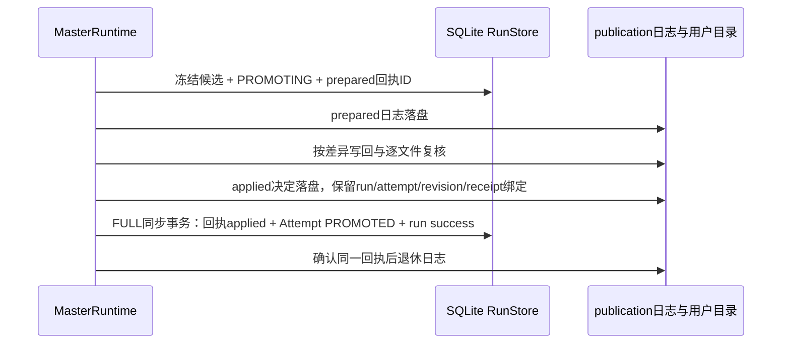

# 非 Git 任务持久化恢复与磁盘 staging 回收

本期为 Linux rootless Podman 的非 Git `/task --resume` 补齐恢复依据。
默认 SQLite 装配支持恢复；旧任务没有快照记录时保守拒绝，不能用当前目录伪造原始输入。
Linux 测试只使用独立 Ubuntu VM。C6 的同 run 租约先取得，再读取任何恢复记录。

## 存储职责

| 部件 | 记录和职责 | 不负责的事 |
|---|---|---|
| `runs.db` 的 `snapshot_run` | 原始输入、最新冻结候选、目录身份/策略绑定、发布回执；与原 Attempt 同库 | 不能凭内容相同推定成功 |
| 项目 publication 日志 | prepared 写回回滚；applied 向 RunStore 交接写回完成事实 | 不生成新的编排决策 |
| `task-staging/<project>/resources.db` | 精确创建意图、目录 inode、活动资源所有者 | 不判断 Attempt 是否通过验收 |
| Podman 资源账本 | 精确清理记录过的容器 | 不删除用户工作目录 |
| run / publication / staging-owner 租约 | 分别保护同 run 执行权、项目写者、资源所有者存活 | 不约束外部编辑器或提供多主机一致性 |

快照采用原有有界、仅数据的规范编码和 `snapshot:<SHA256>` 修订；默认上限为4096个文件与目录、
单文件8MiB、总内容64MiB。读取 BLOB 前先检查存储长度，解码后核对摘要和规范编码。
根路径与 device/inode、排除策略、容量限额须与原记录一致；迁移路径或修改策略不能直接接管。
每个 run 只保留原始输入和最新冻结候选，避免逐 Worker 保存整份历史副本；跨 run 的归档/保留策略仍待设计。

## 恢复规则

| 观察到的持久化事实 | 恢复行为 |
|---|---|
| 没有本期快照记录 | 拒绝，旧编排记录不变 |
| 尚未 PROMOTING，真实目录仍等于原始输入 | 丢弃未完成 Attempt，复用保存的 DAG，从原始输入重跑 |
| PROMOTING，冻结候选匹配，尚未完成写回，真实目录仍等于原始输入 | 复用已通过门禁的冻结候选，只重试发布，不重跑 Worker |
| 有匹配的 applied publication 交接记录 | 补记 SQLite 回执，再退休日志；不重复写回 |
| SQLite 回执已 applied | 返回已完成成果，补记中断状态/退休残留日志；不覆盖发布后人工修改 |
| 无 applied 依据且真实目录已变化，即便内容恰好等于候选 | 拒绝发布，保留文件和记录 |
| 身份、策略、摘要或回执不匹配 | 拒绝；损坏和冲突记录保留供核对 |

PROMOTING 是既有流程通过 Worker、本地验证、独立确定性验收和全局门禁后写入的状态。
冻结候选本身不是验收凭证，RUNNING/VERIFYING/VERIFIED 阶段的中断会重跑整批。
非 Git 恢复不会创建 Git 仓库，不能套用 Git HEAD 判定。

SQLite 和文件系统不能由一个普通事务原子提交，因此保留明确的交接窗口。
prepared 日志未完成时仍按既有发布机制回滚；发现外部修改或回滚冲突则拒绝覆盖。
applied 日志在 SQL 记账之前不会自动删除；新的其他任务和普通交互会被阻止，提示先恢复所属 run。
SQL 写入使用 `synchronous=FULL`，取消仍先排空 SQLite 线程；SQL 回执落盘后才删除交接记录。
run 锁和项目锁不保证多个文件在外部观察者眼中同时变化，也不提供外部系统 exactly-once。

## staging 的创建和回收

1. 在受保护目录建立 SQLite 资源账本、固定项目身份和永久内核锁文件。
2. 创建随机所有者 ID，先持 owner 租约，再提交目录创建意图。
3. 创建0700私有目录，fsync父目录，再把 device/inode 绑定到意图；之后才写候选数据。
4. candidate、Worker、validation 和文件交接临时目录都放进该 owner 根目录。
5. 正常退出按记录精确删除；下一次同项目分配 staging 时，仅回收可取得 owner 租约的旧记录。

回收不扫描系统 `/tmp` 猜归属，不依赖 PID/TTL；活动所有者和未记账目录保留。
路径被替换、链接、权限过宽、inode变化或删除失败时保留资源和账本，停止自动分配。
创建后尚未绑定 inode 的意图只允许清理不存在或空目录，非空目录不能猜删。
原 Git handoff 和普通交互的所有临时目录不是本期统一 GC 的范围；本期覆盖非 Git `/task` 所属目录。

## 证据与边界

最终验收数字及源码清单见 [Linux 验收记录](LINUX_SANDBOX_ACCEPTANCE.md) 末节。
新增测试包括跨平台存储绑定、Linux 恢复故障注入、实际 SIGKILL 资源回收、3个真实 Podman 发布强杀场景。
三个真实窗口分别是日志落盘前、部分文件写回后、applied 决定落盘后而 SQL 回执未完成时；
恢复确认不重跑 Worker、不重复追加，applied 后人工修改保留，staging 和容器无残留。
这些测试使用固定模型步骤，不是新一轮真实 LLM 质量评测；不能扩展成停电/存储设备故障保证。

源码入口：`orchestration/snapshot_store.py`、`master_runtime.py`、`execution/publication.py`、
`execution/task_staging.py`、`workspace/snapshot.py`、`execution/workspace.py`。
NullRunStore 或没有快照适配器的自定义存储仍拒绝非 Git resume。
