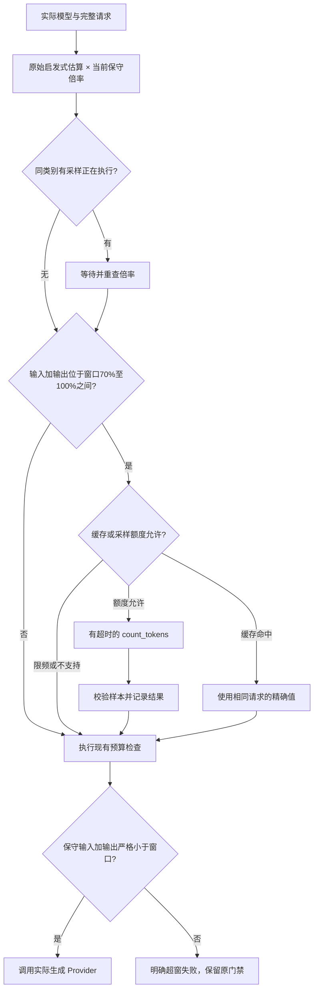

# E10：按模型校准与边界精确计数

本期承接 BACKLOG 的 E10 和 Phase 1 窗口适配。上一阶段已提交 `340b0f1`；本期已验收并随本次提交归档。

## 解决的问题

原来的 `CalibratedTokenEstimator` 没有装配到生产请求，且所有模型共用一个倍率。
它把含工具声明的供应商计数除以只包含消息的启发式估算，容易把工具开销归到文字上。
多 Provider 和角色模型接入后，这样的倍率也会在不同模型之间传播。

本期统一工具声明的 JSON 估算，将估算、精确计数和生成调用分开：

- `Message.token_estimate` 只缓存原始启发式数值，不能写入校准倍率。
- `CalibratedTokenEstimator` 保存会话内的有界状态、采样额度和请求摘要缓存。
- `ModelTokenEstimator` 按实际模型取得倍率，仍提供同步估算。
- 完整请求检查使用消息、工具声明、有效模型窗口和输出预留。
- 精确计数使用实际候选 Provider 的 `count_tokens`，发送完整消息和工具声明。
  Anthropic 的 system、internal_context 和工具协议映射仍由同一 Provider 适配器完成。

## 模型与请求类型隔离

状态键为 `provider:model` 与版本化协议类别：是否包含工具声明/工具协议、是否包含图片载荷。
同名模型在不同 Provider 中不共享倍率，文本、工具、图片类别也不共享。
角色本身不单独建一个倍率：多个角色使用同一 Provider/模型和协议类别时，可以共享样本。
这不是按自然语言、编程语言或每一种 schema 建立精确 tokenizer。

Provider 前缀会在路由层规范化；角色覆盖、能力适配和实际 fallback 候选先确定，再进行计数。
备用模型使用自己的倍率和计数接口；计数接口失败本身不触发生成模型 fallback。
默认 Session、`build_master` 和复用同一会话的 `/task` 共享采样预算；不同会话重新建状态。

## 何时采样

Worker 在图片裁剪和旧工具结果降级后、压缩决策前采样，以免旧载荷影响本轮判断。
生成前再检查最终消息和工具声明；若请求变化，会按缓存和额度规则处理。
Planner、局部/全局 Verifier、Map/Reduce 在实际生成候选边界采样；规划分块本身只做同步估算。
已知超窗的请求直接拒绝，不能靠额外计数、删任务或无限重试争取通过。

指纹包含消息顺序、role、所有 block 内容及完整工具声明；只保存 SHA256 和整数计数。
输出预留、temperature 和窗口不属于输入计数内容，同一实际模型的输入缓存可跨这些参数复用。
取消等待者不会取消另一个请求持有的样本；采样自身被取消时，释放锁并向上传播取消。

## 倍率与失败行为

合法样本必须为非负整数；非空估算对应的零值、布尔、负数、浮点和字符串不能参与校准。
平滑倍率保存供观测；预算倍率取历史高值：

`guard = max(previous_guard, 1, exact / raw × 1.05)`。

一次偏低样本不能降低已有安全余量，默认也不把基线倍率降到 1 以下。
这种做法补偿低估，可能增加保守拒绝和压缩；本期没有实现依靠低计数减少压缩的策略。
供应商计数只精确对应已采样请求，不证明所有后续输入都不会低估。

不支持计数时，一个类别探测一次并在当前会话停止探测；HTTP/鉴权/其他异常和超时消耗
采样额度，记录原因，随后保留原估算或已有倍率。`None` 不能当成零。
Anthropic 缺少 SDK 计数方法返回 `None`，计数请求异常抛结构化 `LlmError`，两者不混淆。
计数证明或校准判断超窗时，在生成调用前拒绝；局部/全局验收继续走已有无法判定门禁，禁止发布。

## 默认限制与配置

| 项目 | 默认 | 配置方式 |
|---|---:|---|
| 自动校准 | 启用 | `CODEAGENT_TOKEN_CALIBRATION=0` 可关闭 |
| 边界比例 | 0.70 | `CalibrationConfig.boundary_ratio` |
| 单次计数超时 | 2 秒 | `CODEAGENT_TOKEN_COUNT_TIMEOUT_SECONDS` |
| 同类别采样间隔 | 60 秒 | `CODEAGENT_TOKEN_COUNT_INTERVAL_SECONDS` |
| 每类别接口尝试数 | 3 | `CalibrationConfig.max_calls_per_cohort` |
| 每会话总接口尝试数 | 16 | `CODEAGENT_TOKEN_COUNT_MAX_CALLS` |
| 最大类别数 | 64 | `CalibrationConfig.max_cohorts` |
| 精确值缓存 | 128 个 | `CalibrationConfig.cache_size` |
| 样本安全余量 | 5% | `CalibrationConfig.safety_ratio` |

缓存按 LRU 淘汰；类别状态不淘汰，避免删除保守倍率或重置已经消耗的额度。
类别上限耗尽后，新类别保留启发式估算，不发送计数请求。
限额针对计数接口尝试，SDK 内部 HTTP 重试不等于新的接口尝试；它不是金额硬预算。
显式 `count_exact` 可绕过边界比例，但仍受超时、间隔和数量限制；直接调用底层 Provider
接口不在自动采样限额之内。

## 观测与边界

新增 `token_calibration` 事件，保存模型、协议类别、原始数值、校准前估算、精确值、偏差、
平滑倍率、预算倍率、结果和调用序号。结果区分成功、不支持、无效样本、失败、超时和取消。
不记录请求正文、图片、工具参数或异常消息。指标为 `tokens.count.*`、`tokens.calibration.scale`。
`/trajectory` JSON 增加 `token_calibrations`，生成用量和已有金额统计保持独立。

当前状态仅在内存，重启后重新采样；不新增恢复权威存储。
计数接口的供应商费用没有进入生成用量/金额表，本期不能由此推断计数免费或总费用下降。
没有新增付费 LLM 实验；固定 Provider/SDK 替身验证计数和门禁，真实容器验证发布与清理。
真实模型的估算偏差分布、压缩频率、任务成功率和总成本应在后续独立评测中量化。

## 验收

最终 Windows 与独立 Ubuntu VM 结果见 README、BACKLOG 和 LINUX_SANDBOX_ACCEPTANCE 的本期记录。
专项包括中英文代码、工具 JSON 基数、图片/工具协议隔离、模型/Provider 隔离、缓存与限频、
并发等待、异常/超时/取消、SDK 序列化、角色与 fallback 的实际计数目标、原历史保留和原发布门禁。
