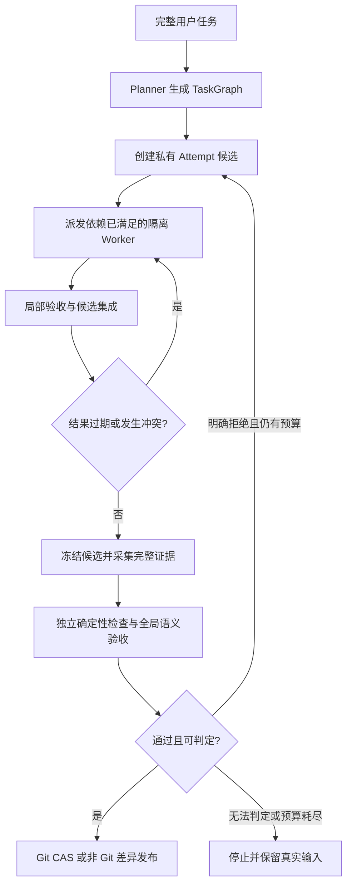
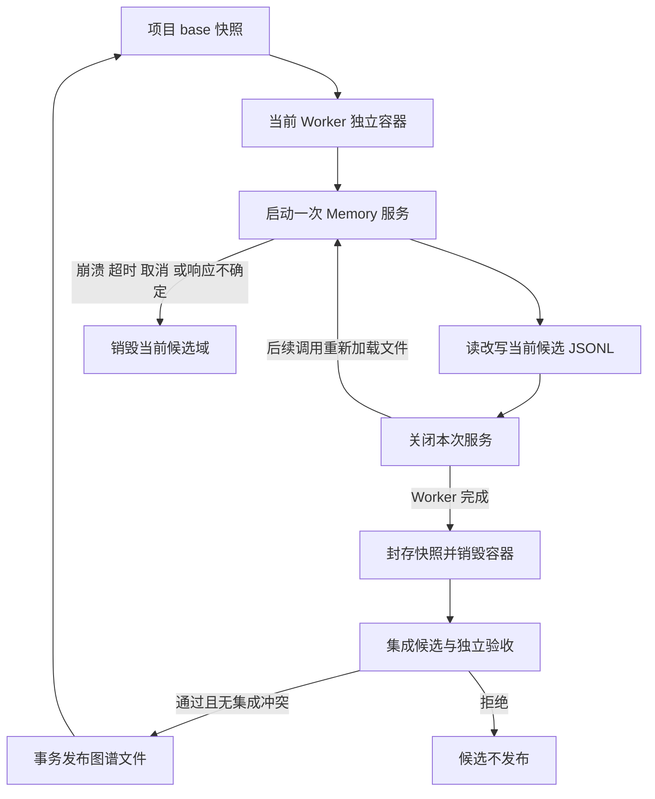
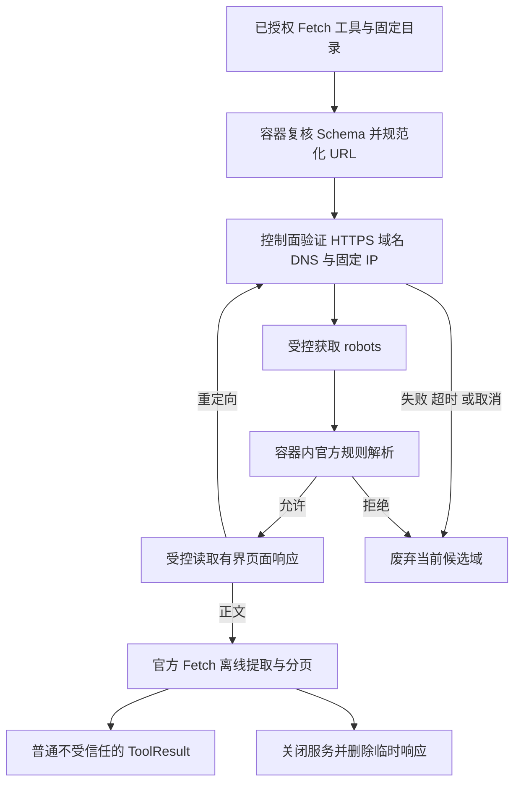

# MindCode 系统架构

本文描述当前 `main` 的基础编排、沙箱与 Skill/MCP/Knowledge 结构。社区接入需显式配置，Knowledge 默认关闭；发布源码验收检查点为 `e3f87c8`，包括响应预算与执行域失效终止修复。测试结果见[最新测试总览](testing/README.md)。

## 模块与职责

| 模块 | 职责 | 源码入口 |
|---|---|---|
| CLI / Session | 接收目标、组装配置和工具、管理会话与审批 | [cli](../codeagent/cli/)、[session.py](../codeagent/session.py) |
| Agent / Runtime | Agent 配置、ReAct 循环、反思与局部验收 | [agent](../codeagent/agent/)、[runtime](../codeagent/runtime/) |
| Skills | 显式加载声明或标准包，冻结正文/资源，编译受限 AgentDefinition，提供 Planner 目录与会话选择 | [skills](../codeagent/skills/)、[设计与用法](skills.md) |
| MCP | 操作者发现并固定服务目录，按本地授权注册工具，社区服务在当前容器调用 | [mcp](../codeagent/tool/mcp/)、[接入与边界](mcp-tools.md) |
| Orchestration | 规划 DAG、调度、候选集成、全局验收与恢复 | [orchestration](../codeagent/orchestration/) |
| Workspace / Execution | Git 与快照版本、容器、发布日志、下载和资源回收 | [workspace](../codeagent/workspace/)、[execution](../codeagent/execution/) |
| LLM | Provider、角色路由、能力门禁、预算、计价与调用观测 | [llm](../codeagent/llm/) |
| Context | 历史、预算、裁剪、Map/Reduce 压缩和 token 校准 | [context](../codeagent/context/) |
| Memory | 长期记忆检索、候选抽取、去重与冲突治理 | [memory](../codeagent/memory/) |
| Evidence / Tool / Infra | 原始事件与产物、工具协议、锁与指标 | [evidence](../codeagent/evidence/)、[tool](../codeagent/tool/)、[infra](../codeagent/infra/) |

## 两条执行路径

普通目标通过 Session 进入 ReAct：准备上下文 → 调用模型 → 执行工具 → 回填结果 → 继续或结束。
选择 Podman 后，普通交互同样经过容器、候选与独立验收发布；`local` 后端仍在本机执行。

`/task` 通过 MasterRuntime 组织多个 Worker：

每个 Attempt 的候选与真实 base 分离。Worker 成功只代表步骤完成，不代表成果已经发布。
前驱成功集成后才解锁后继；读写集重叠或读取基线已变时重跑，冲突可交给 Integrator 处理。
没有声明依赖且读取先集成时，系统不能保证追溯发现所有语义过期；任务图仍须正确表达依赖。

Git 工作区使用 worktree 与提交版本。干净根工作区可通过 CAS fast-forward 发布；含未提交修改的普通交互保留暂存区与 HEAD，按快照差异写回。
非 Git 沙箱任务使用数据快照修订与私有候选，不创建 `.git`，通过发布日志回写实际差异。

## 模型、执行与验收的关系

模型客户端负责生成和判断；工具执行权限由 Agent 工具范围、命令策略、审批与执行后端决定。
模型能力目录中的 `tools=true` 只表示支持协议，不授予文件、网络或外部操作权限。

模型 API 在可信控制面调用，Worker/验收容器保持断网。控制面不把 API 凭据、Git 元数据或状态库装入模型执行目录。
局部验收主要检查步骤目标与运行结果；全局验收读取冻结候选的完整证据，并结合独立确定性命令。
模型的“完成”回复不能替代发布门禁或真实产物检查。

## 数据与恢复依据

| 数据 | 用途与边界 |
|---|---|
| ConversationHistory / TaskCheckpoint | 当前对话与压缩检查点；压缩失败不替换原历史 |
| SQLite RunStore | 任务、Attempt、DAG、状态历史、外部动作与同步成本；恢复的持久事实 |
| 非 Git 快照与发布回执 | 原始输入、冻结候选、目录绑定、已发布依据；内容相同不能替代回执 |
| publication 日志 | 文件写回的 prepared / applied 决定及回滚交接 |
| 容器与 staging 资源账本 | 创建意图、资源身份与所有者租约；精确回收已记录资源 |
| JSONL 事件 / ArtifactStore | 原始事件和工具产物；不把观测日志当作恢复状态权威 |
| memory.db / MEMORY.md | 记忆存储与人审投影；检索失败不阻断普通对话 |
| trajectory JSON | 从 RunStore 和事件重建的观测报告，可能存在历史覆盖缺口 |

同 run 恢复先取得内核租约，再读取恢复记录。Git 使用真实 HEAD 判断 PROMOTING 窗口；非 Git 使用冻结快照和发布回执。
取消先等待后台 SQLite 操作结束再释放租约，避免旧操作与新控制器交叉提交。

## 关键问题与处理

| 问题 | 当前处理 | 剩余边界 |
|---|---|---|
| Worker 基于旧版本输出 | 记录基线和读写集，过期重跑，成功集成后解锁依赖 | 不能代替正确 DAG，也不能识别所有隐藏语义依赖 |
| 失败任务已污染真实目录 | 私有候选与独立验收，最后才发布 | 非 Git 多文件写回不是对外部编辑器的全局原子 CAS |
| 重启后重复推进或追加 | 持久 Attempt、HEAD/回执判断、发布交接与同 run 租约 | 外部 API/DB 动作没有 exactly-once 保证 |
| 多模型窗口与协议不同 | 显式能力目录、实际候选预算、边界 token 校准 | 仍非完整参数协商，也不保证所有未采样输入都精确 |
| 只检查 diff 前缀遗漏问题 | 冻结版本完整 hunk、摘要编号与覆盖检查，最后整体验收 | 覆盖编号不证明模型理解正确，命令覆盖由操作者负责 |
| 费用未知却被当作零 | 同步记录调用意图、已知成本与未知项 | 软阈值不是账单硬上限，计数费用未完整计入生成费用 |

机制与配置见[沙箱与恢复](sandbox-and-recovery.md)、[模型与上下文](model-and-context.md)。

## Skill 的组合与权限问题

Skill 是 Agent 的静态配置层，复用 AgentRegistry 和 Step.agent_id。它不创建新的调度器或恢复账本，也不共享 AgentRun 状态。工作方法描述怎么做，运行时工具交集决定可以做什么。

社区接入增加了另一个问题：能解析一个 Markdown 文件，不代表完整 Skill 可以使用。当前以目录为包保留 scripts/references/assets 等配套，加载时冻结正文和文件内容；模型按需通过专用工具读配套文本。否则正文引用的相对文件可能缺失，或运行中被修改成另一版本。操作者另行授权 Python 入口文件与执行工具后，冻结包在当前容器 tmpfs 展开，镜像 Python 以隔离模式运行，候选数据仍在 `/workspace`。这避免磁盘更新、同名模块或模型参数替换启动源码；脚本依赖预置于镜像，内部代码仍可影响同一候选，因此保守标为可写且不自动重试。Harness 专有工具、非 Python 入口和跨 Skill 引用仍需适配。

包的内容摘要用于固定输入，不能证明发布者可信或方法有效。操作者指定的工具集合与全局权限取交集；包内 allowed-tools 不能新增权限。正文较长时仍受原有上下文预算约束，不能通过安装 Skill 扩大模型窗口。

核心问题是空集合的含义。旧 Agent 用空 tuple 表示不限工具，若直接拿它存储 Skill 的空交集，就会把“没有获得权限”变成“允许所有工具”。一期增加显式 tools_restricted 标记，并在模型请求和真实执行两个位置应用同一集合。模型返回未声明工具仍会得到拒绝结果，不会因为它声称需要该工具就执行。

另外，未知能力不能继承默认 Agent 的更大权限。默认 Planner 可修复未知名称并有明确普通 Agent 回退；绕过 Planner 的自定义或恢复图仍在调度层检查，返回失败 Worker，保持失败到发布门禁的传播。权限正确与模型效果是两种证据：当前固定 Provider 验证前者，后续独立消融才评价后者。

## MCP 的协议与权限为何分开

MCP 解决客户端怎样初始化、发现和调用服务；它没有替 MindCode 决定工具是否获准、效果能否回滚或候选能否发布。服务自报 readOnlyHint 只是输入，不能当作操作者授权。当前先由操作者探测真实服务、固定 catalog 摘要和 Schema，再指定 effect/retry；执行前仍由 ToolExecutionManager 复核 Agent 权限。

如果在宿主启动 Filesystem 服务，它看到的是宿主真实目录，即使 Worker 的其它工具在容器中，仍会出现隔离漏洞。因此社区 MCP 客户端与服务都进入当前 SandboxExecutor 的容器，读取 Worker 当前快照；配置的容器命令来自操作者，服务代码来自只读镜像。缺少容器实现时明确失败，不回落到宿主。

每次调用独立会话，便于让超时、取消和异常退出有清晰的资源所有者，也避免多个 Worker 共享服务内存状态。代价是初始化开销，进程内状态不能跨调用保留。官方 Memory 通过显式 workspace_memory 将 JSONL 写入当前候选工作区，跨调用重新加载文件；同一域的执行锁串行化读改写，各 Worker 使用自己的容器与快照。图谱文件与代码一样，通过独立验收和事务发布后才能成为项目 base；不与自带 SQLite Memory 自动同步，也没有长期服务缓存或知识图谱语义合并。状态调用失败或响应不确定时废弃整个候选域，避免“服务已写入，但返回失败”仍被发布。配置和具体限制见[社区 MCP 接入](mcp-tools.md)。

Git 的主机管理目录不进入快照，临时仓库协议验收不能证明真实提交历史已可用。Resources/Prompts 分别按精确 URI、名称授权并固定目录契约；获取的文本和角色只作为工具结果数据，不能变成系统规则或新增工具权限。真实 Everything 的运行、内容越权与 Worker 发布判据记录在[工具与能力测试](testing/tools-and-skills.md)。

Memory 的文件状态与服务进程分别沿下面的路径管理。其它 Worker 有自己的候选副本；图中只有发布后的文件才能成为后续任务共同继承的 base：

非幂等社区能力还有重放问题：仅给工具标注 `retry=never`，若调度器仍重新运行整个 Worker，代码照样可能再执行。当前把不可重放的注册工具集合固定在 AgentDefinition 中，再按每个 Agent 的有效工具范围判断；含此能力时禁止反思、冲突重跑、全局重规划、BASE_STALE 重跑和未完成任务恢复重跑。判定保守到“授权但未调用”也停重放，代价是降低自动收敛机会；独立只读 Skill 保留原收敛流程。它不代替操作 ID、外部幂等协议或旧配置版本的精确重放。

## Fetch 的网络权限归属

网络权限的所有者是控制面受控入口，官方 Fetch 的职责是解析、robots 规则和内容处理。仅给 URL 做一次白名单检查不够：页面与 robots 都会跳转，DNS 可能返回混合公网/内网地址，返回字符数限制又不能约束下载量。当前每跳先验证目标域名和全部 DNS 记录，将 TLS 连接固定到合法 IP；页面跳转目标重新检查 robots，按字节读取响应，最后把有界内容交给断网容器内的官方服务。

授权域名允许向这些站点发出 GET，并不证明站点内容可信；控制面不带 Cookie、Authorization 或代理凭据，也拒绝含认证信息和查询参数的 URL。请求前后的审计区分“开始连接”和“已收到内容”，摘要绑定本次结果，不能保证下次网页相同。GET 可能已被远端记录，销毁容器不能撤销它，因此禁止自动重放；文件快照、网络动作与记忆图谱具有不同的回滚边界。

HTML 提取显式使用上游依赖的纯 Python 路径，避免 Node 可用时触发自动 npm 安装。容器网络、镜像只读与执行限额仍是实际边界，离线传输适配不是对任意服务代码的完整沙箱。资源所有者、限制及配置见[社区 MCP 接入](mcp-tools.md)。

## Knowledge 与当前候选的关系

Knowledge 是显式调用的项目只读检索，不是长期 Memory，也不成为编排恢复或验收权威。工具按当前候选内容构建文件路径、Python 静态符号及文档段落索引，返回内容版本、文件摘要和来源行号；按引用再次读取时，任何收录内容变化都要求重新搜索。索引不自动注入上下文，返回正文仍不能授权工具或修改系统规则。

Podman 域内只运行注册时冻结的辅助源码，文件读取与 AST 解析都留在该域。每个执行器的派生缓存存于控制面内存，没有索引文件随候选发布。每次枚举与内容哈希确认版本，未变文件复用提取结果，修改/删除/重命名按内容重建；这减少重复解析，并没有省去全范围扫描。多个 Worker、已关闭句柄和主机文件不能混用同一候选索引。辅助程序正常报错且域存活时，仍可普通读文件与 grep；传输硬限额导致域销毁时，旧句柄不可再用，最新模型试验保留了这个缺口。

模型可见正文预算与带缓存的内部传输预算分开检查，辅助程序在写出前遵守执行域实际硬上限。缓存不能容纳时只省略派生缓存，保持完整结果与引用；正文不能容纳则明确报错。执行域失效是控制面生命周期状态，工具批次仍补齐全部结果，ReAct随后结束当前任务，避免让模型对已经关闭的候选继续调用。

隐藏路径、常见凭据文件、链接和当前保守忽略规则限制索引范围。版本仅描述本次可检索内容集，相同内容可以跨分支共享相同版本；它不替代 Git 提交身份、项目快照或发布门禁。完整参数、范围上限和本地模式边界见[Knowledge](knowledge.md)。
