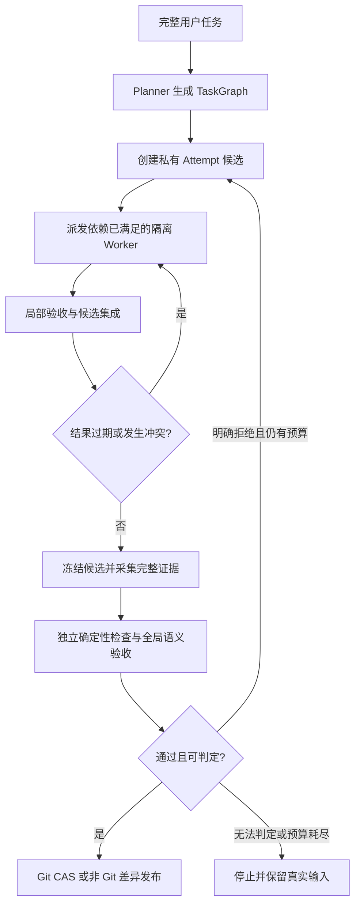

# MindCode 系统架构

本文描述 `main` 已实现的结构；生产与测试源码基线为 `0335117`。测试结果见[最新测试总览](testing/README.md)。

## 模块与职责

| 模块 | 职责 | 源码入口 |
|---|---|---|
| CLI / Session | 接收目标、组装配置和工具、管理会话与审批 | [cli](../codeagent/cli/)、[session.py](../codeagent/session.py) |
| Agent / Runtime | Agent 配置、ReAct 循环、反思与局部验收 | [agent](../codeagent/agent/)、[runtime](../codeagent/runtime/) |
| Orchestration | 规划 DAG、调度、候选集成、全局验收与恢复 | [orchestration](../codeagent/orchestration/) |
| Workspace / Execution | Git 与快照版本、容器、发布日志、下载和资源回收 | [workspace](../codeagent/workspace/)、[execution](../codeagent/execution/) |
| LLM | Provider、角色路由、能力门禁、预算、计价与调用观测 | [llm](../codeagent/llm/) |
| Context | 历史、预算、裁剪、Map/Reduce 压缩和 token 校准 | [context](../codeagent/context/) |
| Memory | 长期记忆检索、候选抽取、去重与冲突治理 | [memory](../codeagent/memory/) |
| Evidence / Tool / Infra | 原始事件与产物、工具协议、锁与指标 | [evidence](../codeagent/evidence/)、[tool](../codeagent/tool/)、[infra](../codeagent/infra/) |

## 两条执行路径

普通目标通过 Session 进入 ReAct：准备上下文 → 调用模型 → 执行工具 → 回填结果 → 继续或结束。
选择 Podman 后，普通交互同样经过容器、候选与独立验收发布；`local` 后端仍在本机执行。

`/task` 通过 MasterRuntime 组织多个 Worker：

每个 Attempt 的候选与真实 base 分离。Worker 成功只代表步骤完成，不代表成果已经发布。
前驱成功集成后才解锁后继；读写集重叠或读取基线已变时重跑，冲突可交给 Integrator 处理。
没有声明依赖且读取先集成时，系统不能保证追溯发现所有语义过期；任务图仍须正确表达依赖。

Git 工作区使用 worktree 与提交版本。干净根工作区可通过 CAS fast-forward 发布；含未提交修改的普通交互保留暂存区与 HEAD，按快照差异写回。
非 Git 沙箱任务使用数据快照修订与私有候选，不创建 `.git`，通过发布日志回写实际差异。

## 模型、执行与验收的关系

模型客户端负责生成和判断；工具执行权限由 Agent 工具范围、命令策略、审批与执行后端决定。
模型能力目录中的 `tools=true` 只表示支持协议，不授予文件、网络或外部操作权限。

模型 API 在可信控制面调用，Worker/验收容器保持断网。控制面不把 API 凭据、Git 元数据或状态库装入模型执行目录。
局部验收主要检查步骤目标与运行结果；全局验收读取冻结候选的完整证据，并结合独立确定性命令。
模型的“完成”回复不能替代发布门禁或真实产物检查。

## 数据与恢复依据

| 数据 | 用途与边界 |
|---|---|
| ConversationHistory / TaskCheckpoint | 当前对话与压缩检查点；压缩失败不替换原历史 |
| SQLite RunStore | 任务、Attempt、DAG、状态历史、外部动作与同步成本；恢复的持久事实 |
| 非 Git 快照与发布回执 | 原始输入、冻结候选、目录绑定、已发布依据；内容相同不能替代回执 |
| publication 日志 | 文件写回的 prepared / applied 决定及回滚交接 |
| 容器与 staging 资源账本 | 创建意图、资源身份与所有者租约；精确回收已记录资源 |
| JSONL 事件 / ArtifactStore | 原始事件和工具产物；不把观测日志当作恢复状态权威 |
| memory.db / MEMORY.md | 记忆存储与人审投影；检索失败不阻断普通对话 |
| trajectory JSON | 从 RunStore 和事件重建的观测报告，可能存在历史覆盖缺口 |

同 run 恢复先取得内核租约，再读取恢复记录。Git 使用真实 HEAD 判断 PROMOTING 窗口；非 Git 使用冻结快照和发布回执。
取消先等待后台 SQLite 操作结束再释放租约，避免旧操作与新控制器交叉提交。

## 关键问题与处理

| 问题 | 当前处理 | 剩余边界 |
|---|---|---|
| Worker 基于旧版本输出 | 记录基线和读写集，过期重跑，成功集成后解锁依赖 | 不能代替正确 DAG，也不能识别所有隐藏语义依赖 |
| 失败任务已污染真实目录 | 私有候选与独立验收，最后才发布 | 非 Git 多文件写回不是对外部编辑器的全局原子 CAS |
| 重启后重复推进或追加 | 持久 Attempt、HEAD/回执判断、发布交接与同 run 租约 | 外部 API/DB 动作没有 exactly-once 保证 |
| 多模型窗口与协议不同 | 显式能力目录、实际候选预算、边界 token 校准 | 仍非完整参数协商，也不保证所有未采样输入都精确 |
| 只检查 diff 前缀遗漏问题 | 冻结版本完整 hunk、摘要编号与覆盖检查，最后整体验收 | 覆盖编号不证明模型理解正确，命令覆盖由操作者负责 |
| 费用未知却被当作零 | 同步记录调用意图、已知成本与未知项 | 软阈值不是账单硬上限，计数费用未完整计入生成费用 |

机制与配置见[沙箱与恢复](sandbox-and-recovery.md)、[模型与上下文](model-and-context.md)。
