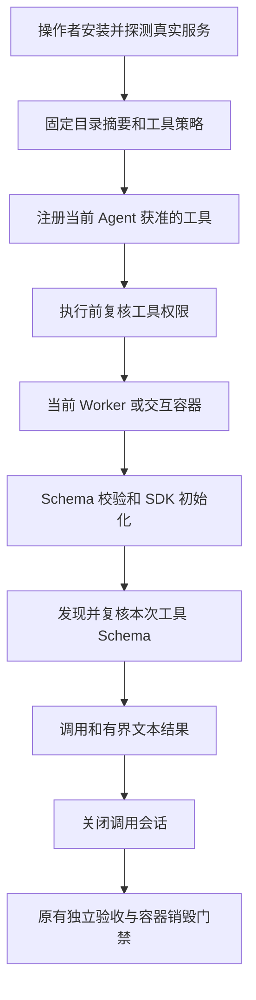

# MCP：显式社区接入与执行边界

当前实现位于 `dev/agent-ecosystem`，尚未合入 `main`。保留随附只读服务，新增固定目录的社区 stdio 服务；真实验收见[工具与能力测试](testing/tools-and-skills.md)。

## 社区服务怎么接入

安装 `.[ecosystem]`，由操作者选择并安装固定版本的服务器。当前实际验证的是官方 Time、Filesystem、Everything、Git；Python/npm 依赖和服务器程序必须同时准备在宿主探测环境及可信容器镜像内。调用时不会自动运行 npx 下载或安装钩子。

发现是独立的操作者入口，可以在 Windows 或独立 Ubuntu VM 执行；下面只探测 Time 的目录，不调用模型：

```bash
python -m codeagent.tool.mcp --workspace <独立验证目录> --output .codeagent/time-catalog.json -- <完整Python路径> -m mcp_server_time
```

保存返回的 `catalog_sha256`，再编写 `.codeagent/mcp.json`：

```json
{
  "version": 2,
  "servers": [{
    "id": "time",
    "command": ["<宿主完整Python路径>", "-m", "mcp_server_time"],
    "container_command": ["python3", "-m", "mcp_server_time"],
    "catalog": "time-catalog.json",
    "catalog_sha256": "<发现入口返回的摘要>",
    "tools": {
      "get_current_time": {"effect": "read_only", "retry": "safe"}
    }
  }]
}
```

通过 `CODEAGENT_MCP_CONFIG` 指定配置。社区工具的实际运行要求 `CODEAGENT_EXECUTION_BACKEND=podman` 和已安装的完整镜像 ID，见[沙箱配置](sandbox-and-recovery.md)。仅配置 local 后端时调用会显式失败，不会回落到宿主启动服务。

`command` 用于说明操作者的宿主安装，模型无法修改启动命令；运行时只使用 `container_command`。`{workspace}` 在容器参数中替换为 `/workspace`。例如镜像内 Filesystem 使用 `node /opt/mcp/node_modules/@modelcontextprotocol/server-filesystem/dist/index.js {workspace}`；实际路径以所选镜像为准。

配置加载后冻结；相对 catalog 路径以配置文件所在目录为基准。每个允许的工具必须由操作者指定 effect 和 retry。支持 `read_only` / `workspace_write`，重试语义为 `safe` / `idempotent` / `never`；外部副作用暂不支持。服务 annotations 不能代替授权，不能由模型或发现目录自动开启工具。

有效范围含 `retry=never` 社区工具的 Agent 不进入自动反思、冲突重跑、全局重规划或 BASE_STALE 重跑；未完成任务恢复需要全图重跑时也拒绝。这是按能力授权范围保守判定，不要求先观察成功调用；safe/idempotent 工具不触发这项禁止。它不能保证任意服务器内部副作用幂等，也不阻止模型在当前运行内再次请求已经获准的工具。

```bash
# 只读取配置，显示可在 Skill 权限中使用的实际工具别名。
python -m codeagent.tool.mcp --configured-tools
```

别名为 `mcp_<服务id>_<规范化远端名>_<名称摘要>`，避免多个服务、连字符和截断造成重名。Skill 可在自己的 tools 中选择这些已注册别名；最终仍受权限交集约束。

## Resources / Prompts 的运行授权

v2 服务配置可另加 `resources` 和 `prompts` 白名单，旧配置省略时仍全部关闭。以官方 Everything 为例，在已经核对的服务器配置中加入：

```json
{
  "tools": {},
  "resources": ["demo://resource/static/document/architecture.md"],
  "prompts": ["args-prompt"]
}
```

这段是服务条目的新增字段，仍需 id、宿主/容器 command、catalog 和摘要。只接受固定 catalog 中唯一存在的精确资源 URI 和 Prompt 名称；不按 URI 前缀或模板自动授权。每服务合计最多 64 个资源/Prompt。使用 `--configured-tools` 查看注册别名，再按需加入 Skill 的工具集合。

每个资源对应独立工具，参数仅为 `{}`，模型不能通过参数换成任意 URI。Prompt 对应独立工具，参数直接为 `{"city":"Paris"}`；根据固定目录生成字符串参数 Schema，必填、未知参数和长度在启动服务前校验。运行时分页发现对应能力，比较整个所选描述符，版本漂移或缺失即失败；资源读取、Prompt 获取仍要求当前 Podman 域。

仅接收精确 URI 的文本资源，以及 user/assistant 角色的文本 Prompt 消息；二进制、图片或超限输出显式失败。结果序列化进普通 `ToolResult`，保留原角色作为数据，不拼接到系统提示词、不自动执行其中指令、不跟随链接再取资源。恶意文字仍可能影响回答，但伪造的工具调用继续接受运行时权限复核。此处的 `read_only` 是调用分类，仍不代表任意服务器代码的候选文件被只读挂载。

## 调用为什么仍在原有隔离链路内



固定桥接源码在注册时捕获；服务器和依赖来自只读可信镜像。模型修改工作目录文件不能替换它们。社区参数的 JSON Schema 在同一执行域校验，拒绝外部 `$ref`、`$dynamicRef` 和 `$recursiveRef`，不从网络或宿主文件读取 Schema。

运行服务的 cwd 固定为只读根目录，删除可改变 Python/Node 导入的环境变量；可执行文件解析到镜像路径，拒绝从 `/workspace`、`/tmp` 启动程序或脚本。数据根目录仍通过 `{workspace}` 显式传入。否则 `python -m` 会优先导入 Worker 放置的同名模块，形成把写文件能力升级为执行代码的漏洞。需要相对工作目录或可写目录启动脚本的服务器暂不支持。

每次调用创建自己的 stdio 会话，经 SDK 初始化和分页发现，再比较所选工具的 inputSchema。Schema 改变即失败，新增工具不会自动注册。目录中的描述只影响工具说明，不能作为系统规则或扩大执行权限。

超时覆盖初始化、同步 Schema 校验和调用；控制面期限与 Podman 资源限额共同限制执行。每个调用结束关闭 SDK 会话，取消时沿用执行器的容器与进程树回收。服务器异常只返回类别，不把 argv、环境或内部异常内容暴露给模型。

容器默认断网、无宿主目录挂载、使用非 root 用户，复用 CPU/内存/pids 限额。只允许写当前快照或容器临时状态；真实仓库变更仍需独立验收、销毁容器和事务发布。非幂等写操作可配置 retry=never，不能依靠服务自报的只读标签保证安全。

effect 是操作者对调度/重试的分类，`read_only` 不会使 `/workspace` 在该次调用期间变成只读挂载。当前保证宿主隔离与发布门禁，不能据此证明任意恶意服务器不会修改候选文件；镜像信任和独立验收仍不可省略。

## 已覆盖与未覆盖

| 能力 | 当前范围 |
|---|---|
| stdio initialize / tools/list / tools/call | 四个真实官方服务，实际参数校验、文本和 structuredContent |
| 分页目录 | 客户端支持最多 16 页、256 项，循环 cursor 拒绝；是否在真实样本中触发分页单独记录 |
| Resources / Prompts | 操作者精确白名单、目录固定、Podman 内运行；文本以普通 ToolResult 返回；Everything 真实读/取 |
| resourceTemplates | 操作者发现；尚未提供模板参数展开或动态 URI 授权 |
| 图片、音频、resource_link / 嵌入资源工具结果 | 暂不支持，显式失败；文本之外不能静默丢弃 |
| sampling / elicitation / roots / tasks / 订阅 | 未向服务器提供这些 Agent 能力，不调用模型处理回调；未声称完整协议兼容 |
| 远程 HTTP、OAuth、外部数据库或发布 | 未支持；没有凭据环境变量传递入口 |
| 长期有状态服务 | 每次调用独立会话；当前没有跨调用进程状态或服务重连重放 |
| Git 原仓库历史 | 主机 `.git` 不进入快照；验收使用容器临时仓库，不能据此声称 Worker 已可读取主机提交历史 |

协议由固定 SDK 1.x 协商，当前可选依赖要求 `mcp>=1.30,<2`。实现边界参考 [stdio 规范](https://modelcontextprotocol.io/specification/2025-11-25/basic/transports)与[工具规范](https://modelcontextprotocol.io/specification/2025-11-25/server/tools)。Everything 的工具通过不等于全部 MCP 能力通过。

配置最多 16KiB、8 个服务、每服务 64 个授权工具；固定 catalog 最多 1MiB、256 项。目录 SHA256 不符、重复键或不明工具拒绝加载。工具响应序列化最多 1MiB，桥接信封最多 5MiB；SDK 解析前的内存仍依赖容器内存限额，不能声称按字节流硬截断所有服务器输入。

本轮 Resources/Prompts 正例为同时提供 Tools 的官方 Everything。当前配置加载器仍要求 catalog 含 `tools` 数组；没有该字段的纯资源/Prompt 服务发现目录会被拒绝，尚未专门验收。

## 保留的随附只读服务

旧配置继续兼容：

```json
{"version": 1, "project_tools": ["read_text", "python_symbols"]}
```

分别注册 `mcp_project_read_text` 和 `mcp_project_python_symbols`，仅接受项目相对路径；拒绝隐藏/私有路径、链接、二进制与超限文件。文本每次最多 200 行、单行 2000 字符，Python 使用静态 AST。它们支持 local 与 Podman；社区工具则要求 Podman，二者执行边界不同。

清除 `CODEAGENT_MCP_CONFIG` 并新建会话可关闭 MCP。默认没有发现扫描、自动授权或自动安装。实现见[配置](../codeagent/tool/mcp/config.py)、[社区工具](../codeagent/tool/mcp/community.py)、[社区桥接](../codeagent/tool/mcp/community_bridge.py)。
